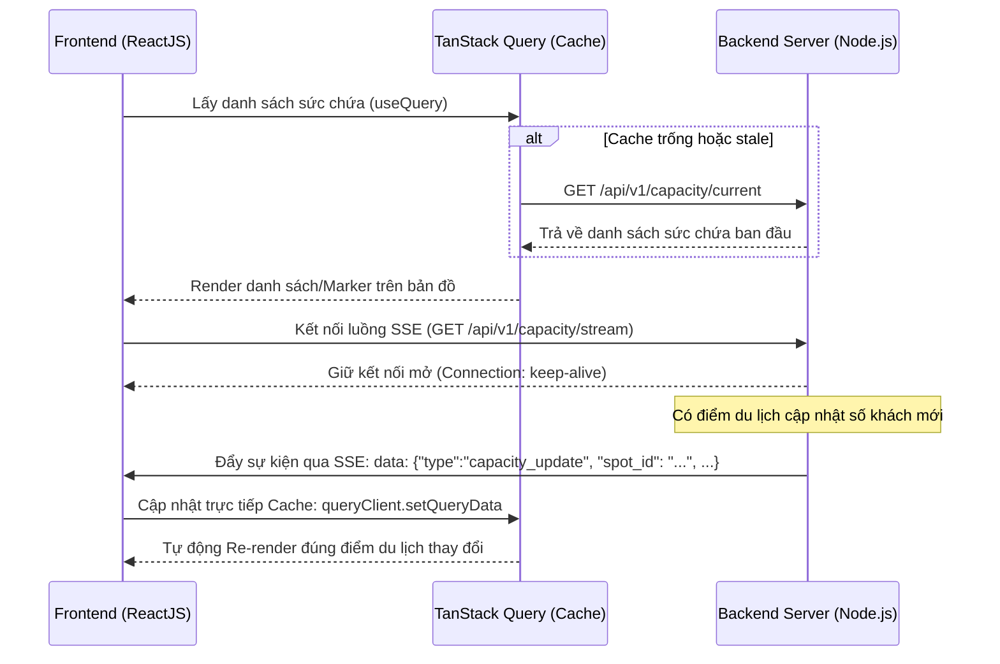

# Kiến trúc Đồng bộ Thời gian thực: TanStack Query + Server-Sent Events (SSE)

Tài liệu này hướng dẫn giải thích nguyên lý thiết kế và cách tích hợp giữa **TanStack Query (React Query)** và **Server-Sent Events (SSE)** để cập nhật dữ liệu sức chứa điểm du lịch (`capacity`) theo thời gian thực trên giao diện Frontend (Bản đồ WebGIS, Dashboard).

---

## 1. Nguyên lý Hoạt động (Architectural Pattern)

Mô hình này là sự kết hợp hoàn hảo giữa **kéo dữ liệu chủ động (Pull - HTTP GET)** và **đẩy dữ liệu thụ động (Push - SSE)** nhằm đạt được hiệu năng cao nhất và giảm tải tối đa cho máy chủ:

---

## 2. Giải thích Các Bước Thực Hiện Chi Tiết

### Bước 1: Fetch dữ liệu danh sách ban đầu (`useQuery`)
*   **Hành động:** Khi người dùng truy cập trang bản đồ hoặc dashboard, ứng dụng gọi `useQuery` để thực hiện yêu cầu HTTP GET đến endpoint `/api/v1/capacity/current`.
*   **Mục đích:** Lấy toàn bộ danh sách điểm du lịch và trạng thái sức chứa hiện tại nhanh nhất để dựng khung giao diện.
*   **Ưu điểm:** Tận dụng tối đa khả năng lưu bộ nhớ đệm (Caching), trạng thái tải dữ liệu (`isLoading`), lỗi (`error`) có sẵn của TanStack Query.

### Bước 2: Thiết lập kết nối luồng thời gian thực (`EventSource`)
*   **Hành động:** Trong một hook `useEffect`, khởi tạo đối tượng `EventSource` trỏ đến luồng phát `/api/v1/capacity/stream`.
*   **Mục đích:** Duy trì một kết nối HTTP mở, nhẹ nhàng để đón nhận các sự kiện đẩy về từ Server.
*   **Dọn dẹp (Cleanup):** Khi người dùng chuyển trang (Component bị hủy), cần gọi `eventSource.close()` để đóng kết nối, tránh rò rỉ bộ nhớ (Memory leak) và quá tải kết nối ở Server.

### Bước 3: Đột biến Cache trực tiếp (`queryClient.setQueryData`)
*   **Hành động:** Khi Server phát đi một sự kiện cập nhật (`capacity_update`), Client phân tích dữ liệu JSON nhận được, định vị chính xác điểm du lịch có `spot_id` thay đổi và ghi trực tiếp giá trị mới (`visitor_count`, `capacity_pct`, `status`) vào cache hiện tại của TanStack Query.
*   **Mục đích:** Cập nhật dữ liệu mà không cần gọi lại (Refetch) toàn bộ danh sách từ Server.

---

## 3. Tại sao mô hình này tối ưu vượt trội?

### 🚀 Hiệu năng cực cao (High Performance)
*   Thay vì tải lại (Refetch) toàn bộ danh sách 100 điểm du lịch mỗi khi có 1 điểm thay đổi lượng khách, hệ thống chỉ nhận đúng **1 mảnh thông tin thay đổi** siêu nhỏ và cập nhật ngay vào RAM.
*   React và TanStack Query sẽ chỉ kích hoạt việc **vẽ lại (Re-render) đúng thành phần UI** của điểm du lịch đó. Bản đồ không bị giật lag hay tải lại toàn bộ Marker.

### 🛡️ Tiết kiệm băng thông & Hạ tải máy chủ (Server Efficiency)
*   **Giảm số lượng Request:** Triệt tiêu hoàn toàn kỹ thuật Polling (liên tục gọi lại API mỗi 5-10 giây).
*   **Truyền tải nhẹ nhàng:** SSE hoạt động trên giao thức HTTP chuẩn, cực kỳ nhẹ. Server chỉ đẩy dữ liệu thô dạng chuỗi JSON rất ngắn khi thực sự có biến động dữ liệu.

### 🛠️ Tự động phục hồi kết nối (Resilience)
*   Đối tượng `EventSource` của trình duyệt có cơ chế **tự động kết nối lại (Auto-reconnect)** mặc định. Nếu người dùng bị mất mạng tạm thời (đi vào thang máy, đường hầm), kết nối sẽ tự khôi phục ngay khi có mạng mà không cần lập trình viên phải viết thêm code phức tạp.
